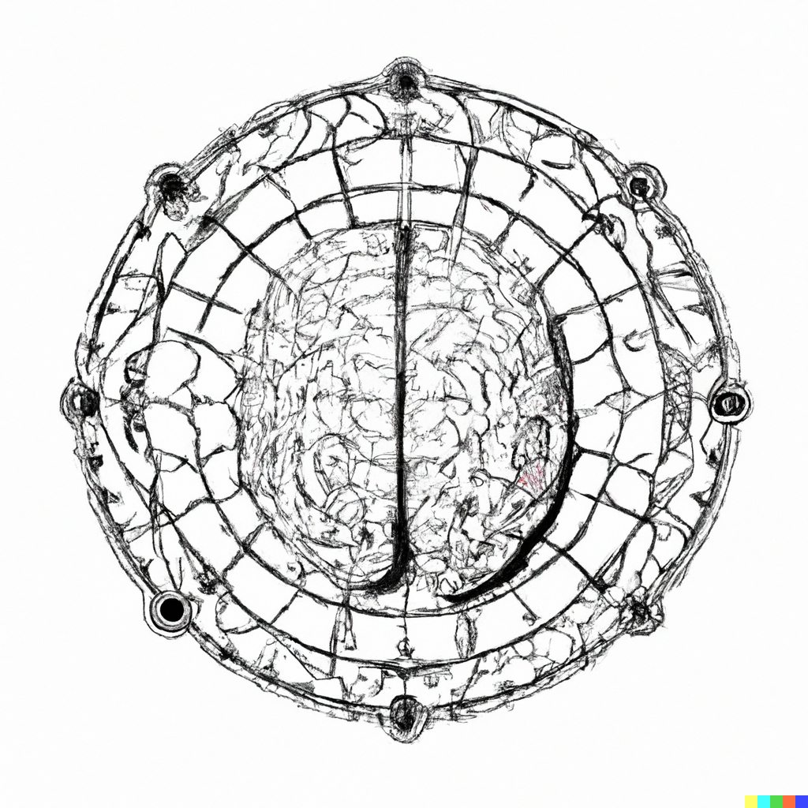

# brain-text

  

## Overview
This repository contains a project aimed at transcribing brain waves into text. It utilizes the Neurosity SDK's concepts of Kinesis and Predictions for this purpose.

## Table of Contents
- [Kinesis for Gesture Recognition](#kinesis-for-gesture-recognition)
- [User Notification](#user-notification)
- [Predictions for Text Generation](#predictions-for-text-generation)
- [Machine Learning](#machine-learning)
- [Text Generation from Thinking](#text-generation-from-thinking)
- [Additional Documentation](#additional-documentation)

---

### Kinesis for Gesture Recognition
- [Start Parsing](#start-parsing): Use a pre-defined gesture to initiate the brainwave parsing process.

---

### User Notification
- [Reading Prompt](#reading-prompt): Notify the user to start reading a text on the screen once the parsing begins.

---

### Predictions for Text Generation
- [Word Matching](#word-matching): Use Predictions to match the parsed brainwave data with words from the text.

---

### Machine Learning
- [Training](#training): Repeatedly perform this exercise with different texts to train the machine learning model.

---

### Text Generation from Thinking
- [Reverse Process](#reverse-process): Utilize the trained model to generate text directly from thinking.

---

## Additional Documentation
- [Approach to Brain-Text Transcription](Approach.md)
- [Neurosity SDK Metrics Overview](Metrics.md)
- [Utility of OpenAPI in the Project](OpenAPI_Utility.md)
- [Gesture Recognition Capabilities and Limitations](Gesture_Recognition_Limitations.md)
- [Software Stack for Machine Learning](Software_Stack_for_ML.md)
- [TensorFlow.js Capabilities Relevant to this Project](TensorFlow_JS_Capabilities.md)
- [Model Selection for Brain-Text Transcription](Model_Selection.md)

---

## Getting Started
(Instructions for setting up the project)

## Contributing
(Instructions for contributing to the project)

## License
License information will be updated later.
